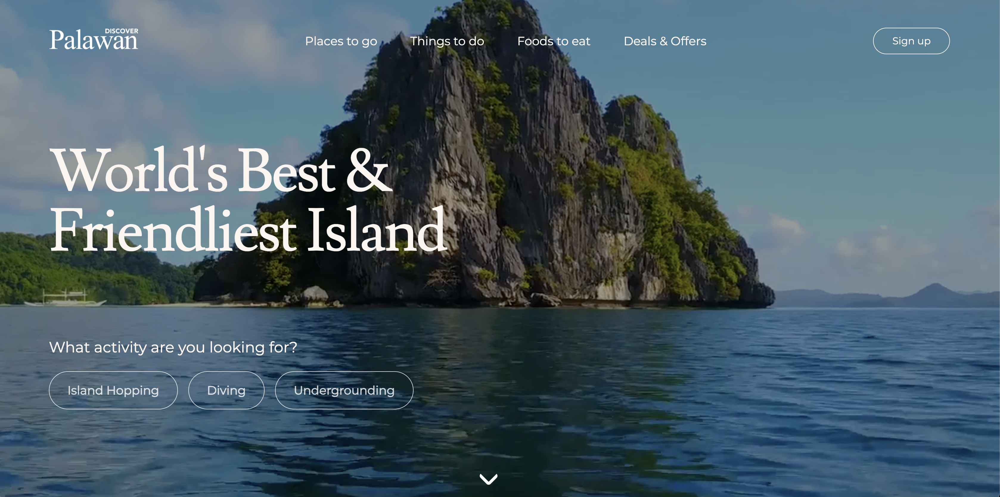

<!-- Improved compatibility of back to top link: See: https://github.com/othneildrew/Best-README-Template/pull/73 -->

<a id="readme-top"></a>

<!-- PROJECT SHIELDS -->

[![Contributors][contributors-shield]][contributors-url]
[![Forks][forks-shield]][forks-url]
[![Stargazers][stars-shield]][stars-url]
[![Issues][issues-shield]][issues-url]
[![MIT License][license-shield]][license-url]
[![LinkedIn][linkedin-shield]][linkedin-url]

<!-- PROJECT LOGO -->

<div align="center">
  <a href="https://github.com/Snorlark/Palawan-Tour">
    
  </a>

  <h1 align="center">Palawan | Official Travel Site for Palawan Islands</h1>

  <p align="center">
    A static, content-rich travel site that showcases the best of Palawan: places to go, things to do, local delicacies, and curated deals & offers.
    <br />
    <a href="https://github.com/Snorlark/Palawan-Tour"><strong>Explore the repo »</strong></a>
    <br />
    <br />
    <a href="https://snorlark.github.io/Palawan-Tour/index.html">View Live Demo</a>
    &middot;
    <a href="https://github.com/Snorlark/Palawan-Tour/issues">Report Bug</a>
    &middot;
    <a href="https://github.com/Snorlark/Palawan-Tour/issues">Request Feature</a>
  </p>
</div>

<details>
  <summary>Table of Contents</summary>
  <ol>
    <li>
      <a href="#about-the-project">About The Project</a>
      <ul>
        <li><a href="#built-with">Built With</a></li>
        <li><a href="#key-features">Key Features</a></li>
      </ul>
    </li>
    <li>
      <a href="#getting-started">Getting Started</a>
      <ul>
        <li><a href="#prerequisites">Prerequisites</a></li>
        <li><a href="#installation">Installation</a></li>
        <li><a href="#deployment">Deployment</a></li>
      </ul>
    </li>
    <li><a href="#project-structure">Project Structure</a></li>
    <li><a href="#features">Features</a></li>
    <li><a href="#security-and-privacy">Security and Privacy</a></li>
    <li><a href="#roadmap">Roadmap</a></li>
    <li><a href="#contributing">Contributing</a></li>
    <li><a href="#license">License</a></li>
    <li><a href="#contact">Contact</a></li>
    <li><a href="#acknowledgments">Acknowledgments</a></li>
    <li><a href="#review">Review</a></li>
  </ol>
</details>

## About The Project

<br />

This website presents Palawan’s most iconic destinations and activities through a clean, responsive, and media-forward design. The landing page features a background video hero, clear navigation, and quick links to key experiences like Island Hopping, Diving, and the Underground River.

### Why this project?

- **Discoverability**: Curates the most sought-after destinations in one place.
- **Clarity**: Simple navigation to places, activities, foods, and deals.
- **Speed**: Static hosting for fast, reliable access worldwide.

### Built With

- HTML5
- CSS3
- Google Fonts (Montserrat, Lusitana)
- Font Awesome 4.7
- GitHub Pages (for hosting)

### Key Features

- Video hero with prominent tagline and CTA buttons
- Sections for Destinations, Activities, Foods, Deals & Offers
- Instagram-style image gallery feed
- Frequently Asked Questions (accordion)
- Email signup CTA linking to `signup.html`
- Consistent footer with developer profile links

<p align="right">(<a href="#readme-top">back to top</a>)</p>

## Getting Started

### Prerequisites

- A web browser (Chrome, Firefox, Safari, Edge)

### Installation

1. Clone the repository
   ```sh
   git clone https://github.com/Snorlark/Palawan-Tour.git
   cd Palawan-Tour
   ```
2. Open `index.html` in your browser
   - Double-click `index.html`, or
   - Serve locally with a simple HTTP server (optional):
     ```sh
     python3 -m http.server 8080
     # visit http://localhost:8080
     ```

### Deployment

This site is designed for static hosting. Recommended: GitHub Pages.

1. Push to the `main` branch
2. In GitHub, go to Settings → Pages → Deploy from branch → `main` → `/ (root)`
3. Save and wait for the deployment to complete

Live Demo: `https://snorlark.github.io/Palawan-Tour/index.html`

<p align="right">(<a href="#readme-top">back to top</a>)</p>

## Project Structure

```
Palawan-Tour/
├── index.html                  # Landing page with video hero
├── places.html                 # Destinations overview
├── things.html                 # Things to do
├── foods.html                  # Foods to eat
├── deals.html                  # Deals & offers
├── travel-guide.html           # Travel guide
├── signup.html                 # Email signup page
├── css/                        # Page-specific styles
├── img/                        # Images, icons, video
└── README.md                   # This file
```

<p align="right">(<a href="#readme-top">back to top</a>)</p>

## Features

### Home

- Full-width background video with headline “World's Best & Friendliest Island”
- Quick action buttons: Island Hopping, Diving, Undergrounding
- "All You Need to Know" cards linking to destinations, activities, foods, tours, and travel guide

### Destinations (`places.html`)

- Responsive image gallery linking to detailed location pages (Coron, El Nido, Taytay, Puerto Princesa, Brooke's Point, Bataraza)

### Activities & Tours

- Dedicated pages for Island Hopping, Shipwreck Diving, and Underground River

### Foods

- Local delicacies and dishes with imagery

### FAQ

- Collapsible Q&A for common travel questions

### Footer & Socials

- Links to Facebook, Instagram, LinkedIn, plus developer contact

<p align="right">(<a href="#readme-top">back to top</a>)</p>

## Security and Privacy

- This is a static front-end project. There are **no API keys or secrets** required.
- Avoid committing any sensitive information (tokens, credentials, `.env` files).
- External links open in new tabs where appropriate; validate third-party links periodically.
- If you add forms or analytics later, follow data minimization and consent best practices.

<p align="right">(<a href="#readme-top">back to top</a>)</p>

## Roadmap

- [ ] Improve accessibility (semantic landmarks, contrast, focus states)
- [ ] Expand SEO (meta tags, Open Graph, sitemap)
- [ ] Add responsive fine-tuning for small screens
- [ ] Optimize media (images/video) with modern formats
- [ ] Optional: Convert to a small static site generator for content reusability

See the [open issues](https://github.com/Snorlark/Palawan-Tour/issues) for current tasks and feature requests.

<p align="right">(<a href="#readme-top">back to top</a>)</p>

## Contributing

Contributions are welcome! Please open an issue to discuss major changes first.

1. Fork the repo
2. Create a feature branch (`git checkout -b feature/amazing-feature`)
3. Commit changes (`git commit -m "feat: add amazing feature"`)
4. Push to your branch (`git push origin feature/amazing-feature`)
5. Open a Pull Request

<p align="right">(<a href="#readme-top">back to top</a>)</p>

## License

Distributed under the MIT License. See `LICENSE` for details.

<p align="right">(<a href="#readme-top">back to top</a>)</p>

## Contact

**Lark Sigmuond Babao** – `larksigmuondbabao@gmail.com`

- LinkedIn: `https://www.linkedin.com/in/lark-sigmuond-babao-9a8a012b2/`
- GitHub: `https://github.com/Snorlark`
- Facebook: `https://www.facebook.com/larksigmuondbabao/`
- Portfolio: `https://larkbabao-portfolio-5p93.vercel.app/`
- Live Demo: `https://snorlark.github.io/Palawan-Tour/index.html`

Project Link: `https://github.com/Snorlark/Palawan-Tour`

<p align="right">(<a href="#readme-top">back to top</a>)</p>

## Acknowledgments

- Google Fonts
- Font Awesome
- GitHub Pages
- Best README Template – inspiration for structure

<p align="right">(<a href="#readme-top">back to top</a>)</p>

## Review

Summary of changes in this README:

- Added badges, logo/title, and table of contents
- Documented site features, structure, and deployment steps
- Added security/privacy notes suitable for a static site
- Linked to live demo and contact channels

<p align="right">(<a href="#readme-top">back to top</a>)</p>

<!-- MARKDOWN LINKS & IMAGES -->

[contributors-shield]: https://img.shields.io/github/contributors/Snorlark/Palawan-Tour.svg?style=for-the-badge
[contributors-url]: https://github.com/Snorlark/Palawan-Tour/graphs/contributors
[forks-shield]: https://img.shields.io/github/forks/Snorlark/Palawan-Tour.svg?style=for-the-badge
[forks-url]: https://github.com/Snorlark/Palawan-Tour/network/members
[stars-shield]: https://img.shields.io/github/stars/Snorlark/Palawan-Tour.svg?style=for-the-badge
[stars-url]: https://github.com/Snorlark/Palawan-Tour/stargazers
[issues-shield]: https://img.shields.io/github/issues/Snorlark/Palawan-Tour.svg?style=for-the-badge
[issues-url]: https://github.com/Snorlark/Palawan-Tour/issues
[license-shield]: https://img.shields.io/github/license/Snorlark/Palawan-Tour.svg?style=for-the-badge
[license-url]: https://github.com/Snorlark/Palawan-Tour/blob/main/LICENSE
[linkedin-shield]: https://img.shields.io/badge/-LinkedIn-black.svg?style=for-the-badge&logo=linkedin&colorB=555
[linkedin-url]: https://www.linkedin.com/in/lark-sigmuond-babao-9a8a012b2/
